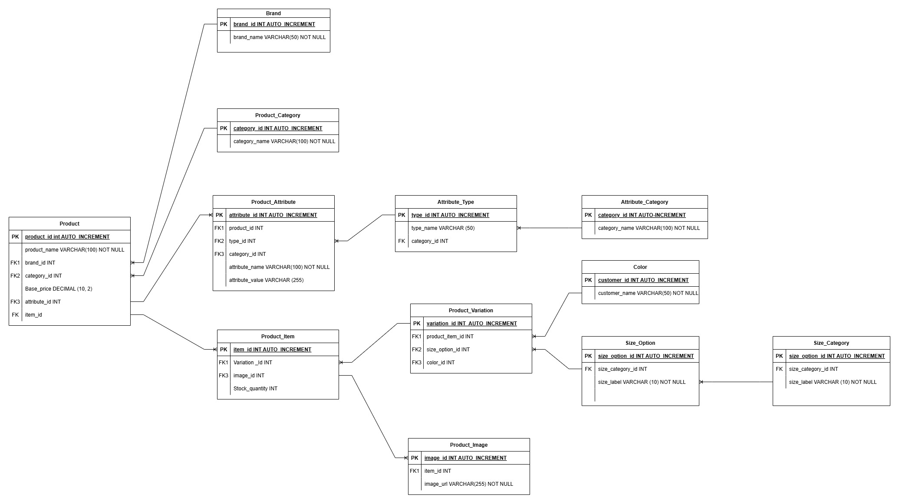

# 📦 E-commerce-Database-Design

## 🎯 Objective

The project aimed to design an E-commerce database.

## ✍️ Creation of ERD

The Entity relation diagram was created in draw io. It shows the entities (tables) and their attributes. Also, the primary keys, foreign keys, and other constraints are highlighted.

## The entities or tables in the database are;

1. 🖼️ product_image – Stores product image URLs or file references
2. 🎨 color – Manages available color options
3. 🗂️ product_category – Classifies products into categories (e.g., clothing, electronics)
4. 📦 product – Stores general product details (name, brand, base price)
5. 🧾 product_item – Represents purchasable items with specific variations
6. 🏷️ brand – Stores brand-related data
7. 🔄 product_variation – Links a product to its variations (e.g., size, color)
8. 📏 size_category – Groups sizes into categories (e.g., clothing sizes, shoe sizes)
9. 📐 size_option – Lists specific sizes (e.g., S, M, L, 42)
10. 🧵 product_attribute – Stores custom attributes (e.g., material, weight)
11. 📚 attribute_category – Groups attributes into categories (e.g., physical, technical)
12. 🧪 attribute_type – Defines types of attributes (e.g., text, number, boolean)

## Relationships

The relationships defined in the ERD diagram are as follows;

- product ↔ brand (many-to-one)

- product ↔ product_category (many-to-one)

- product_item ↔ product_variation (many-to-one)

- product_variation ↔ color and size_option (many-to-one each)

- size_option ↔ size_category (many-to-one)

- product_image ↔ product_item (many-to-one)

- product ↔ product_attribute (one-to-many)

- product_attribute ↔ attribute_type (many-to-one)

- attribute_type ↔ attribute_category (many-to-one)

# 🤝 Contributor

Rollins: https://github.com/Rollins255

Charles Owino: https://github.com/Charles-Owino-Agwanda
